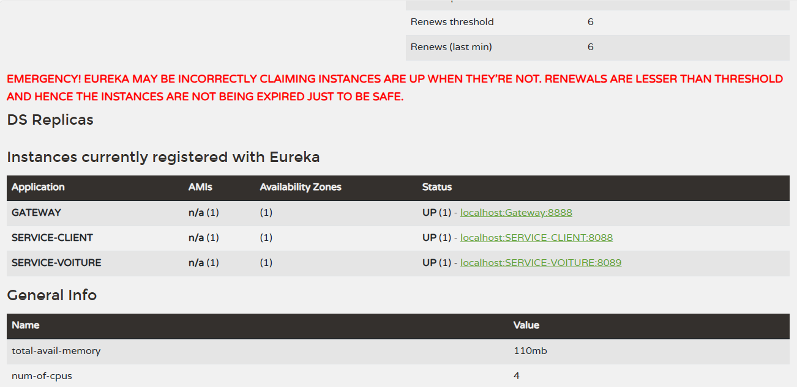

# Microservices pour Gestion des Clients et des Voitures avec Eureka et Gateway

Ce projet propose une mise en place de microservices utilisés pour gérer les informations relatives aux clients et aux voitures d'une entreprise, avec l'intégration d'Eureka pour le registre des services et d'une Gateway pour la gestion des routes et la sécurité.

## Prérequis

Assurez-vous d'avoir installé les outils suivants avant de commencer :

- Java JDK 8 ou supérieur
- Maven
- Spring Boot
- Xampp ou une autre base de données (dans ce cas, nous utilisons MySQL comme base de données)

## Microservices inclus

### 1. Service des Clients

Le service des clients gère toutes les opérations liées aux clients de l'entreprise, y compris la création, la mise à jour, la suppression et la récupération des informations clients.

#### Endpoint

- **GET /clients:** Récupère la liste de tous les clients.
  

- **GET /clients/{id}:** Récupère les détails d'un client spécifique.
  

- **POST /clients:** Crée un nouveau client.
  
- **PUT /clients/{id}:** Met à jour les informations d'un client existant.
  

### 2. Service des Voitures

Le service des voitures est responsable de toutes les opérations liées aux voitures, y compris l'ajout, la mise à jour, la suppression et la récupération des informations sur les voitures.

#### Endpoint

- **GET /voitures:** Récupère la liste de toutes les voitures.

- **GET /voitures/client/{id_client}:** Récupère la liste de toutes les voitures par client.

- **GET /voitures/{id}:** Récupère les détails d'une voiture spécifique.

- **POST /voitures:** Ajoute une nouvelle voiture.
- **PUT /voitures/{id}:** Met à jour les informations d'une voiture existante.

## Serveur Eureka

Le serveur Eureka est utilisé comme registre des services pour permettre à chaque microservice de s'enregistrer et de découvrir les autres services disponibles dans le système.

### Accès à Eureka Dashboard

[http://localhost:8761](http://localhost:8761)

## Gateway

La Gateway agit comme un point d'entrée central pour tous les microservices, gérant la gestion des routes, l'authentification et l'autorisation. Une fois que tous les services sont démarrés, vous pouvez accéder à la gateway à l'URL [http://localhost:8888](http://localhost:8888) pour interagir avec les microservices.

Les services clients et voitures sont accessibles respectivement à [http://localhost:8888/SERVICE-CLIENT/clients](http://localhost:8888/SERVICE-CLIENT/clients)

et [http://localhost:8888/SERVICE-VOITURE/voitures](http://localhost:8888/SERVICE-VOITURE/voitures).

## Configuration

Chaque microservice a son propre fichier de configuration qui doit être personnalisé en fonction de l'environnement (développement, production, etc.). Assurez-vous de mettre à jour ces fichiers avant de déployer les microservices.

## Dépendances

- **Base de données:** Chaque microservice utilise sa propre base de données. Assurez-vous de configurer les connexions de base de données dans les fichiers de configuration.
Dans ce projet on utilise MySQL vous pouvez les modifier en fonctions de vos besoins.

---
